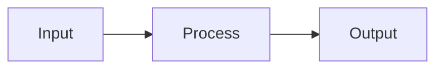

# Nextra docs editing protocol

These sites are Nextra 4 + Next.js 15 docs with static export, built on the shared `@sygnal/nextra-docs-engine` package. Most of what's special is *what not to do* — the obvious-looking things that break the build or produce silent runtime warnings.

## Project layout

- `src/content/` — all `.mdx` pages. Routing is derived from filenames.
- `src/content/_meta.js` — sidebar config. Controls order, display titles, and group separators. **Every page must have an entry here or it won't appear in the sidebar.**
- `src/content/styleguide.mdx` — canonical reference for every supported component and markdown element. **Read this before deriving syntax from training data** — it shows exactly what's wired up here.
- `src/app/layout.tsx` — root layout. Brand text, footer, metadata title template live here. **Per-project.**
- `src/app/[[...slug]]/page.tsx` — dynamic page handler. Threads `sourceCode` to the wrapper.
- `src/mdx-components.tsx` — thin wiring file that calls `createUseMDXComponents({ meta })` from the engine. 4 lines.
- `src/app/globals.css` — imports the engine's stylesheet then layers project overrides.
- `src/app/opengraph-image.tsx` — branded OG image. **Per-project.**
- `public/` — static assets. Images go here.
- `next.config.mjs` — Nextra wrapper with `output: 'export'`, `images.unoptimized: true`, latex, codeblock search, mermaid transpile.

## The engine

The engine (`@sygnal/nextra-docs-engine`) provides:

- **Components** (registered globally via `createUseMDXComponents`): `Callout`, `DataTable`, `Embed`, `Video`, `YouTube`. No import needed in MDX.
- **Demo wrappers** (explicit imports for styleguide): `ButtonDemo`, `CollapseDemo`, `SelectDemo`.
- **`createPageBreadcrumb(meta)`** — custom breadcrumb factory (most consumers use it via `createUseMDXComponents`).
- **`/styles.css`** — breadcrumb + sidebar separator styling.

Do not duplicate engine components in `src/components/`. If you need a project-specific override, pass it via the factory options (e.g. `createUseMDXComponents({ meta, Callout: MyCustomCallout })`).

## Hard rules (these will break the build or produce warnings if violated)

### Image paths

Images live in `/public`. Reference them as **root-relative** paths:

```md

```

**Never** use `../../public/file.png` from inside `src/content/`. Nextra's `staticImage` resolver treats markdown image paths as imports relative to the MDX file, so `../../public/...` resolves to `src/public/...` which doesn't exist and breaks the build with a misleading "Server Components render" error on an unrelated page.

### Alt text is required

Every image needs alt text. Next.js's `<Image>` throws a runtime warning when `alt` is missing, even from markdown `` syntax. Empty alt = warning.

### Version pinning

`package.json` pins `next` and `nextra` to **exact** versions (no `^`). Caret ranges have resolved to `next 15.5.19` / `nextra 4.6.1` in the past, which break `/_not-found` prerender with `<Html> should not be imported outside of pages/_document`. The known-good pair is `next 15.5.4` / `nextra-theme-docs 4.6.0` / `nextra 4.6.0`. The engine's peer deps require these exact versions. If you bump, run a full `npm run build` first.

### Git history must exist

Nextra reads `git log` to populate "last updated" timestamps. If the project isn't a git repo (or has no commits), the build prints `Failed to get the last modified timestamp from Git` warnings for every MDX file. Not fatal, but noisy. Run `git init && git add -A && git commit` if missing.

### Don't re-add features Nextra already ships

Several features look like they're missing because they're invisible until triggered. Verify by grepping Nextra's source before building a replacement:

- **Heading hover `#` anchor** — already in `nextra/styles/subheading-anchor.css` via `.subheading-anchor::after { content: '#' }`. Hidden at `opacity: 0` until you hover. Adding a duplicate rule produces `##`.
- **Copy page button + ChatGPT/Claude menu** — shipped as the theme's `CopyPage` component. Requires `sourceCode` to be passed to the wrapper in `src/app/[[...slug]]/page.tsx`.
- **Last updated timestamp** — shipped as `LastUpdated`, default-on when `metadata.timestamp` (git mtime) is available.

Before authoring a new component or CSS rule that replicates a "GitBook-like" feature, **grep the Nextra packages**:

```
Grep "<feature-name>" in d:\Projects\Docs\Nextra\packages\
```

Check both `.tsx` (components) AND `.css` (styling).

### No metadata files inside `[[...slug]]`

The route is `src/app/[[...slug]]/page.tsx` — an **optional** catch-all. Do not colocate Next metadata files (`opengraph-image.tsx`, `twitter-image.tsx`, `icon.tsx`, etc.) inside that directory:

- Dev: `Catch-all must be the last part of the URL.`
- Build: `Requested and resolved page mismatch: //opengraph-image /opengraph-image`

**For a site-wide image:** put it at `src/app/opengraph-image.tsx` (the root segment).

**For per-page images:** use a build-time script (`satori` + `@resvg/resvg-js` → `public/og/<slug>.png`), then point `openGraph.images` at the generated path from `generateMetadata`.

### No event handlers in MDX

MDX content is rendered as a React Server Component. You **cannot** pass functions (event handlers like `onClick`, `onChange`) directly from MDX to a client component — you'll get:

```
Event handlers cannot be passed to Client Component props.
```

The runtime error message points at `src/app/[[...slug]]/page.tsx` line ~19, which is misleading — the real cause is the offending MDX file.

**Fix:** move the interactive bit into a `'use client'` component (the engine ships `ButtonDemo`, `CollapseDemo`, `SelectDemo` for this purpose — pattern in `src/components/styleguide-demos.tsx` if you need new ones), then import that into MDX.

```mdx
{/* ❌ Breaks at runtime */}
<Button onClick={() => alert('hi')}>Click</Button>

{/* ✅ Works */}
import { ButtonDemo } from '@sygnal/nextra-docs-engine'
<ButtonDemo />
```

Plain object props are fine — `style={{...}}`, `data-*`, string/number/boolean values. Only **functions** trigger this error.

### Static export constraints

`next.config.mjs` sets `output: 'export'`. This means:
- `images.unoptimized: true` is mandatory (already set)
- No server components that depend on request data
- No API routes
- No dynamic routes without `generateStaticParams`
- Metadata file routes (`opengraph-image.tsx`, `icon.tsx`, etc.) MUST export `export const dynamic = 'force-static'`, or the build fails with: `export const dynamic = "force-static"/export const revalidate not configured on route "/opengraph-image" with "output: export"`.

## Adding a page

Two-step. Skipping either leaves the page invisible or unrouted.

1. Create `src/content/<slug>.mdx` with frontmatter:
   ```mdx
   ---
   title: Page Title
   description: One-sentence summary for SEO and previews.
   ---

   # Page Title

   Content here…
   ```
2. Add an entry to `src/content/_meta.js`:
   ```js
   export default {
     index: 'Overview',
     'new-slug': 'New Page Title',
     // ...
   }
   ```
   Use `'slug': 'Display Title'` for simple cases or `'slug': { title: '...', theme: {...} }` for per-page options.

For a nested section, create `src/content/<section>/` with its own `_meta.js`.

## Renaming or removing a page

- **Rename**: rename the `.mdx` file AND update the key in `_meta.js`. Update any internal links (`[label](/old-slug)` → `[label](/new-slug)`).
- **Remove**: delete the `.mdx` file AND remove the key from `_meta.js`. Grep for internal links to it and update them.

## Callout collision

The engine registers a custom `<Callout>` globally that *shadows* Nextra's built-in. Implications:

- In MDX, plain `<Callout>` resolves to the **engine's** Callout.
- Variants: `default | info | tip | success | warning | error | important` plus an optional `emoji` prop. Each type has distinct color + icon — `important` is purple with a shield, `tip` is teal with a lightbulb.
- If you specifically want Nextra's Callout in a page, import it with an alias:
  ```mdx
  import { Callout as NextraCallout } from 'nextra/components'

  <NextraCallout type="info">…</NextraCallout>
  ```

When picking which to use: the engine's is the house style (it's what the styleguide documents). Prefer it unless you want Nextra's specifically.

## Components available

From `nextra/components`: `Callout`, `Steps`, `Tabs`, `Cards`, `FileTree`, `Bleed`, `Banner`, `Collapse`, `Button`, `ImageZoom`, `Popup`, `Select`, `Playground`.

From `@sygnal/nextra-docs-engine` (registered globally — no import needed in MDX): `Callout` (overrides Nextra's), `DataTable`, `YouTube`, `Video`, `Embed`.

From `@sygnal/nextra-docs-engine` (explicit import for styleguide use): `ButtonDemo`, `CollapseDemo`, `SelectDemo`.

Plus Mermaid diagrams via fenced code blocks (see below).

Don't re-derive syntax from memory. Open `src/content/styleguide.mdx` — it has a working example of every one of these with the exact import line.

### Cards are nav tiles, not description blocks

`Cards.Card` is designed for **title + optional icon + optional arrow**. Always use the self-closing form:

```mdx
<Cards>
  <Cards.Card title="Concepts" href="/concepts" arrow />
  <Cards.Card title="Setup" href="/setup" arrow />
</Cards>
```

**Do not put paragraph or description text inside a card.** Children render as a banner area *above* the title bar with zero padding — the slot is meant for full-bleed images. Plain text in that slot looks broken.

If you need title + description, use a definition list, a table, or a markdown list with linked headings.

### Mermaid diagrams

Fenced code blocks tagged `mermaid` render as live diagrams via `@theguild/remark-mermaid`. Requires `transpilePackages: ['@theguild/remark-mermaid']` in `next.config.mjs` (already wired in template).

````md

````

Prefer Mermaid over screenshots of diagrams: editable in source, themes with the site, sharp at any zoom.

### Interactive components need a 'use client' wrapper

`Collapse` and `Select` from `nextra/components` are *controlled* — they take an `isOpen` / `value` prop and an `onChange` callback, so they need `useState`. MDX is server-rendered and can't hold hooks.

Pattern: the engine ships `ButtonDemo`, `CollapseDemo`, `SelectDemo` for the styleguide. For new interactive demos in a consumer project, create `src/components/<name>-demo.tsx` with `'use client'` at top and import into MDX.

### DataTable (rich tables)

Use for tables where cells need anything beyond one line of plain text — multiple paragraphs, lists, callouts, code blocks, components. For simple comparison rows, GFM `|`-syntax is faster.

Registered globally — no import needed.

```mdx
<DataTable
  headers={['Feature', 'Status', 'Notes']}
  widths={['20%', '15%', '65%']}
  align={['left', 'center', 'left']}
  caption="Optional caption."
>
  <DataTable.Row>
    <DataTable.Cell>Auth</DataTable.Cell>
    <DataTable.Cell>✅</DataTable.Cell>
    <DataTable.Cell>
      Supports:

      - OAuth via Clerk
      - Magic link via Resend

      <Callout type="warning">SSO is not in v1.</Callout>
    </DataTable.Cell>
  </DataTable.Row>
</DataTable>
```

**Props:**

| Prop | Type | Notes |
| --- | --- | --- |
| `headers` | `ReactNode[]` | optional. Omit for headerless tables. |
| `align` | `('left' \| 'center' \| 'right')[]` | optional. Per-column, applied to header + body. |
| `widths` | `(string \| number)[]` | optional. CSS values like `'20%'`, `'160px'`. |
| `caption` | `ReactNode` | optional. Rendered above the table. |
| `className` | `string` | optional wrapper class. |

Children must be `<DataTable.Row>`. Each row contains `<DataTable.Cell>` (or `<DataTable.HeaderCell>` for inline headers). Cells support `colSpan`, `rowSpan`, per-cell `align` override.

**Authoring rules:**

- Cell count must match `headers.length`. Use `colSpan` deliberately if fewer.
- **Markdown-in-JSX requires blank lines.** Cells with lists or paragraphs need a blank line between `<DataTable.Cell>` and the content. Without it the MDX parser treats content as inline.
- Don't nest a `<DataTable>` inside another `<DataTable>` cell — works mechanically but reads as noise. Use lists or `Tabs`.
- For numeric columns use `align="right"`. For status badges/icons use `align="center"`.
- **Prefer GFM tables when you can.** Reach for DataTable only when GFM can't carry the content.

### Sidebar grouping (`_meta.js`)

For multi-section docs, group sidebar entries under labeled headers using `{ type: 'separator', title: 'GROUP NAME' }`. The key is arbitrary — Nextra only reads `type` and `title`.

```js filename="src/content/_meta.js"
export default {
  index: 'Overview',

  'core': { type: 'separator', title: 'Core' },
  concepts: 'Concepts',
  architecture: 'Architecture',

  'reference': { type: 'separator', title: 'Reference' },
  styleguide: 'Style Guide'
}
```

Rules:
- `{ type: 'separator', title: '...' }` → bold group header (rendered indigo + uppercase by engine CSS)
- `{ type: 'separator' }` (no title) → plain `<hr>`
- Group headers can appear in any `_meta.js`. Nested headers add visual hierarchy.
- The engine's `PageBreadcrumb` reads the top-level `_meta.js` and prepends the active group as the first crumb (in indigo).
- Don't add group headers for sections with only 1-2 pages — overhead outweighs structure.

### YouTube / Video / Embed

Three media wrappers, registered globally so no import needed:

- `<YouTube id="..." />` — privacy-enhanced YouTube embed. Optional `title`, `start`, `aspectRatio={[w, h]}`.
- `<Video src="..." />` — HTML5 `<video>` with `controls`, `preload="metadata"`, `playsInline`. `src` can be string or `[{ src, type }]` for multi-format.
- `<Embed url="..." />` — URL-routed dispatcher. Known providers (YouTube, Vimeo, Loom, CodePen, Figma) render as iframes; unknown URLs become link cards. Use when source varies; use the dedicated wrapper when you know.

## Code blocks

Beyond plain fenced code, these directives work:

- `\`\`\`ts filename="path/to/file.ts"` — show a filename header
- `\`\`\`js {2,4-6}` — highlight specific lines
- `\`\`\`ts showLineNumbers` — show line numbers
- `\`\`\`js /useState/` — highlight a token everywhere it appears
- `\`\`\`diff` — diff syntax highlighting

Combinable: `\`\`\`ts filename="x.ts" {3} showLineNumbers`.

## LaTeX

Enabled via `latex: true` in `next.config.mjs`. Inline: `$x^2$`. Block: `$$ ... $$`. Standard KaTeX syntax.

## Verifying changes

**Type-check is not enough.** `npm run build` runs prerender steps that catch MDX compilation errors and bad image imports invisible to TypeScript. After any content edit:

```bash
npm run build
```

Postbuild runs `pagefind` for search indexing.

For dev: `npm run dev` then open `http://localhost:3000`. **Do not start the dev server yourself** unless explicitly asked.

## Troubleshooting recipe

When a build fails with `An error occurred in the Server Components render` and a vague "page X failed" — the error reporter often misattributes. Check in order:

1. Look for `../../public/...` in any `.mdx` (bad image path).
2. Check `package.json` versions: must be `next 15.5.4`, `nextra 4.6.0`, `nextra-theme-docs 4.6.0`.
3. Verify `src/app/not-found.ts` does NOT exist (only needed for the version-mismatch workaround).
4. Re-run with `NODE_ENV=development npx next build` for an unredacted error — diagnostic only, never commit with NODE_ENV set.

If you see `<Html> should not be imported outside of pages/_document`: the version-pinning issue. Reinstall with the pinned versions.

## Don't do these

- Don't add a `pages/` directory — App Router only. Mixing routers triggers the `<Html>` error.
- Don't add `not-found.tsx` or `404.tsx` unless the pinned-versions advice fails.
- Don't duplicate engine components in `src/components/` — use the factory's override hook (`Callout` option) or upstream the change to the engine.
- Don't add comments to `.mdx` files explaining MDX syntax to humans — write the docs themselves clearly instead.
