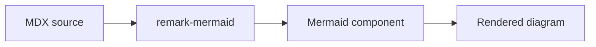

import { Callout as NextraCallout, Steps, Tabs, Cards, FileTree, Bleed, ImageZoom, Popup } from 'nextra/components'
import { ButtonDemo, CollapseDemo, SelectDemo } from '@sygnal/nextra-docs-engine'

# Style Guide

A reference of every markdown element and component available in this template. Use it as a cheat sheet when authoring pages.

## Typography

### Headings

```md
# Heading 1
## Heading 2
### Heading 3
#### Heading 4
##### Heading 5
###### Heading 6
```

Headings 2–4 are automatically picked up by the table of contents on the right.

### Paragraphs and inline formatting

A regular paragraph supports **bold text**, *italic text*, ***bold italic***, ~~strikethrough~~, `inline code`, and [links to other pages](/) or [external URLs](https://nextra.site).

You can combine them: a **bold [link](https://nextra.site)** or *italic `code`*.

### Blockquotes

> Documentation is a love letter that you write to your future self.
>
> — Damian Conway

Nested blockquotes:

> Outer quote.
>
> > Inner quote.

### Horizontal rule

---

## Lists

### Unordered

- First item
- Second item
- Third item
  - Nested item
  - Another nested item
    - Deeply nested

### Ordered

1. First step
2. Second step
3. Third step
   1. Sub-step
   2. Sub-step

### Task list

- [x] Completed task
- [x] Another completed task
- [ ] Pending task
- [ ] Future task

## Tables

| Component   | Source                       | Purpose                          |
| ----------- | ---------------------------- | -------------------------------- |
| `Callout`   | `@sygnal/nextra-docs-engine` | Highlight a block of information |
| `Steps`     | `nextra/components`          | Number sequential instructions   |
| `Tabs`      | `nextra/components`          | Group alternative content        |
| `Cards`     | `nextra/components`          | Linkable card grid               |
| `DataTable` | `@sygnal/nextra-docs-engine` | Rich tables with components in cells |
| `FileTree`  | `nextra/components`          | Render a folder structure        |
| `Bleed`     | `nextra/components`          | Extend content past the gutter   |

Column alignment:

| Left aligned | Centered | Right aligned |
| :----------- | :------: | ------------: |
| `npm`        |    1.x   |          ✔️   |
| `pnpm`       |    9.x   |          ✔️   |
| `yarn`       |    4.x   |          ✔️   |

## Images

Place images in `/public` and reference them with a root-relative path. Nextra optimizes them automatically and the engine wraps them in click-to-zoom:


For finer control, use the engine's `<ImageZoom>` explicitly:

<ImageZoom src="/toolbar.png" alt="Toolbar screenshot" width={1200} height={300} />

## Code

### Inline code

Use backticks for `inline code` references like `npm install`, file names like `next.config.mjs`, or short snippets.

### Fenced code block

```js
const greet = (name) => `Hello, ${name}!`
console.log(greet('world'))
```

### With filename

```ts filename="src/lib/greet.ts"
export const greet = (name: string) => `Hello, ${name}!`
```

### Line highlighting

```js {2,4-6}
const a = 1
const b = 2 // highlighted
const c = 3
const d = 4 // highlighted
const e = 5 // highlighted
const f = 6 // highlighted
```

### Line numbers

```ts showLineNumbers
function add(a: number, b: number) {
  return a + b
}

add(2, 3)
```

### Word highlighting

```js /useState/
import { useState } from 'react'

function Counter() {
  const [count, setCount] = useState(0)
  return <button onClick={() => setCount(count + 1)}>{count}</button>
}
```

### Diff-style

```diff
- const old = 'value'
+ const next = 'value'
```

### Shell

```bash
npm install nextra nextra-theme-docs
```

## Math (LaTeX)

Inline math: $E = mc^2$ and $\sum_{i=1}^{n} i = \frac{n(n+1)}{2}$.

Block math:

$$
\int_{-\infty}^{\infty} e^{-x^2} \, dx = \sqrt{\pi}
$$

## Engine components

These come from `@sygnal/nextra-docs-engine`. They're registered globally by `createUseMDXComponents` so no import is needed in MDX content.

### Callout

The engine's `<Callout>` shadows Nextra's built-in. Seven variants with distinct color + icon:

<Callout>
  This is the default callout. Use it for general notes.
</Callout>

<Callout type="info">
  Info callout — helpful supplementary information.
</Callout>

<Callout type="tip">
  Tip callout — a pro tip or "did you know" aside.
</Callout>

<Callout type="success">
  Success callout — confirm something is working.
</Callout>

<Callout type="warning">
  Warning callout — caution the reader.
</Callout>

<Callout type="error">
  Error callout — flag a critical problem.
</Callout>

<Callout type="important">
  Important callout — highlight non-skippable details (distinct purple styling).
</Callout>

```mdx
<Callout type="warning">Caution the reader.</Callout>
```

### Callout (Nextra built-in)

Imported as `NextraCallout` to avoid colliding with the engine's:

<NextraCallout>Default Nextra callout.</NextraCallout>
<NextraCallout type="info">Info variant.</NextraCallout>
<NextraCallout type="warning">Warning variant.</NextraCallout>
<NextraCallout type="error">Error variant.</NextraCallout>

```mdx
import { Callout as NextraCallout } from 'nextra/components'

<NextraCallout type="info">Your content here.</NextraCallout>
```

### YouTube

`<YouTube>` embeds a privacy-enhanced (`youtube-nocookie.com`) player at a 16:9 aspect ratio.

<YouTube id="_C3DXRUoQKw" title="Sample YouTube video" />

```mdx
<YouTube id="dQw4w9WgXcQ" title="Optional title" />
<YouTube id="..." start={120} />
<YouTube id="..." aspectRatio={[4, 3]} />
```

### Video

`<Video>` wraps the native HTML5 `<video>` element with sensible defaults.

```mdx
<Video src="/clips/intro.mp4" poster="/clips/intro-poster.jpg" />

{/* Multi-format fallback */}
<Video
  src={[
    { src: '/clips/intro.webm', type: 'video/webm' },
    { src: '/clips/intro.mp4',  type: 'video/mp4'  }
  ]}
/>
```

Drop video files under `/public` and reference them with root-relative paths.

### Embed

`<Embed url="...">` is a one-stop wrapper for arbitrary URLs. Known providers render as a rich iframe; unknown URLs fall back to a simple link card.

Currently routed providers: **YouTube**, **Vimeo**, **Loom**, **CodePen**, **Figma**.

<Embed url="https://www.youtube.com/watch?v=_C3DXRUoQKw" title="YouTube via Embed" />

Unknown URL → link card fallback:

<Embed url="https://nextra.site/" title="Nextra documentation" />

```mdx
<Embed url="https://www.youtube.com/watch?v=..." />
<Embed url="https://vimeo.com/123456789" />
<Embed url="https://www.loom.com/share/abc..." />
<Embed url="https://codepen.io/user/pen/xyz..." />
<Embed url="https://www.figma.com/file/abc.../Title" />
```

Prefer the dedicated `<YouTube>` / `<Video>` components when you know the source; use `<Embed>` when the source could vary.

### DataTable

For tables where cells need anything beyond one line of plain text — multiple paragraphs, lists, callouts, components. For simple comparison rows, GFM `|`-syntax is faster.

<DataTable
  headers={['Component', 'When to use', 'Notes']}
  widths={['18%', '32%', '50%']}
>
  <DataTable.Row>
    <DataTable.Cell>**GFM table**</DataTable.Cell>
    <DataTable.Cell>
      Simple comparison rows with one line of plain text per cell.
    </DataTable.Cell>
    <DataTable.Cell>
      Pipe-and-dash syntax (`| col | col |`). Authored inline in MDX. Fastest to write.
    </DataTable.Cell>
  </DataTable.Row>
  <DataTable.Row>
    <DataTable.Cell>**`<DataTable>`**</DataTable.Cell>
    <DataTable.Cell>
      Cells need multiple paragraphs, lists, or embedded components.
    </DataTable.Cell>
    <DataTable.Cell>
      Examples of things you can put in a cell:
      - Bulleted lists
      - <Callout type="tip">Yes, even other Callouts.</Callout>
      - `<code>` and **bold** and [links](/)
    </DataTable.Cell>
  </DataTable.Row>
</DataTable>

Column alignment:

<DataTable
  headers={['Left', 'Centered', 'Right']}
  align={['left', 'center', 'right']}
>
  <DataTable.Row>
    <DataTable.Cell>`npm`</DataTable.Cell>
    <DataTable.Cell>1.x</DataTable.Cell>
    <DataTable.Cell>✔︎</DataTable.Cell>
  </DataTable.Row>
  <DataTable.Row>
    <DataTable.Cell>`pnpm`</DataTable.Cell>
    <DataTable.Cell>9.x</DataTable.Cell>
    <DataTable.Cell>✔︎</DataTable.Cell>
  </DataTable.Row>
</DataTable>

```mdx
<DataTable
  headers={['Column A', 'Column B']}
  widths={['30%', '70%']}
  align={['left', 'right']}
  caption="Optional caption rendered above the table."
>
  <DataTable.Row>
    <DataTable.Cell>Cell content</DataTable.Cell>
    <DataTable.Cell>
      Can contain **markdown**, components, lists — anything MDX allows.
    </DataTable.Cell>
  </DataTable.Row>
</DataTable>
```

## Nextra components

### Steps

<Steps>

### Install dependencies

Run `npm install` to fetch the template's dependencies.

### Configure your content

Edit `src/content/_meta.js` to control the sidebar order.

### Run the dev server

```bash
npm run dev
```

### Build and deploy

```bash
npm run build
```

</Steps>

### Tabs

<Tabs items={['npm', 'pnpm', 'yarn', 'bun']}>
  <Tabs.Tab>
    ```bash
    npm install nextra nextra-theme-docs
    ```
  </Tabs.Tab>
  <Tabs.Tab>
    ```bash
    pnpm add nextra nextra-theme-docs
    ```
  </Tabs.Tab>
  <Tabs.Tab>
    ```bash
    yarn add nextra nextra-theme-docs
    ```
  </Tabs.Tab>
  <Tabs.Tab>
    ```bash
    bun add nextra nextra-theme-docs
    ```
  </Tabs.Tab>
</Tabs>

### Cards

<Cards>
  <Cards.Card title="Overview" href="/" arrow />
  <Cards.Card title="Nextra docs" href="https://nextra.site" arrow />
  <Cards.Card title="Next.js docs" href="https://nextjs.org/docs" arrow />
</Cards>

### FileTree

<FileTree>
  <FileTree.Folder name="src" defaultOpen>
    <FileTree.Folder name="app" defaultOpen>
      <FileTree.File name="layout.tsx" />
      <FileTree.Folder name="[[...slug]]">
        <FileTree.File name="page.tsx" />
      </FileTree.Folder>
    </FileTree.Folder>
    <FileTree.Folder name="content" defaultOpen>
      <FileTree.File name="_meta.js" />
      <FileTree.File name="index.mdx" />
      <FileTree.File name="styleguide.mdx" />
    </FileTree.Folder>
    <FileTree.File name="mdx-components.tsx" />
  </FileTree.Folder>
  <FileTree.File name="next.config.mjs" />
  <FileTree.File name="package.json" />
</FileTree>

### Bleed

<Bleed>
  
</Bleed>

### Mermaid diagrams



### Interactive demos

Buttons:

<ButtonDemo />

Collapse:

<CollapseDemo />

Select:

<SelectDemo />

These three come from `@sygnal/nextra-docs-engine` — they're pre-built `'use client'` wrappers for the engine's interactive Nextra components (`Button`, `Collapse`, `Select`), which can't be invoked inline from MDX because MDX is server-rendered.

### Popup

Hover the underlined term for a definition:{' '}
<Popup>
  <Popup.Button as="span" style={{ textDecoration: 'underline', textDecorationStyle: 'dotted', cursor: 'help' }}>
    Pagefind
  </Popup.Button>
  <Popup.Panel style={{ padding: '0.75rem 1rem', background: 'var(--nextra-bg, #fff)', border: '1px solid #e5e7eb', borderRadius: '6px', boxShadow: '0 4px 12px rgba(0,0,0,0.08)', fontSize: '0.875rem', maxWidth: '20rem' }}>
    A static-site search library. Indexes content at build time and serves results from a CDN — no backend required.
  </Popup.Panel>
</Popup>

## Sidebar grouping (`_meta.js`)

Long sidebars get unwieldy without section headers. Add a `separator` with a `title` between groups:

```js filename="src/content/_meta.js"
export default {
  index: 'Overview',

  'core': { type: 'separator', title: 'Core' },
  concepts: 'Concepts',
  architecture: 'Architecture',

  'reference': { type: 'separator', title: 'Reference' },
  styleguide: 'Style Guide'
}
```

The engine's `PageBreadcrumb` reads the same `_meta.js` and prepends the active group as the leading crumb when present. Sidebar separator labels are styled to match (indigo + uppercase) via `@sygnal/nextra-docs-engine/styles.css`.

## Frontmatter

Each page may declare a `title` and `description` in YAML frontmatter:

```mdx
---
title: My Page
description: One-sentence summary used for SEO and previews.
---

# My Page

Content here…
```
